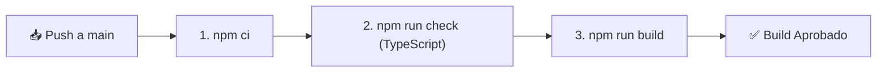

# 🧪 Guía de Herramientas de Desarrollo, Testing y CI/CD

> Documentación de las herramientas de compilación, verificación automatizada, pruebas E2E y flujos de integración continua en **HabboSpeed 2026**.

---

## 🔍 1. Suite de Verificación Automatizada (Playwright E2E)

HabboSpeed incluye una suite de pruebas End-to-End basada en **Playwright** que verifica en segundos que la aplicación está lista para producción:

```bash
npm run verify:ui
```

### ¿Qué comprueba esta suite?
1. **Carga Inmediata de Portada (`/`):** Garantiza que no existan parpadeos en negro, bloqueos por skeletons ni errores de hidratación de React.
2. **Reproducción del Stream de Audio:** Activa el botón verde de Play en portada y valida que el estado del elemento `<audio>` sea `readyState: 4` y `paused: false`.
3. **Comprobación de Rutas Principales:** Navega automáticamente por `/radio`, `/djpanel`, `/admin`, `/news`, `/team` y `/feria`, validando que no existan excepciones (`TypeError` o pantallas de error).
4. **Capturas Visuales Automáticas:** Genera screenshots de control en la carpeta `screenshots/` para auditoría visual.

---

## 🚀 2. Scripts de Desarrollo y Ejecución

En `package.json` dispones de comandos estandarizados:

| Comando | Descripción |
| :--- | :--- |
| `npm run start:all` | **Lanzador Todo en Uno:** Inicia AzuraCast (8005) + Servidor Web (5000) en paralelo. |
| `npm run dev` | Inicia el servidor Express en desarrollo con TypeScript (`tsx`) y Vite HMR. |
| `npm run radio` | Inicia el servidor de radio local AzuraCast / Icecast en el puerto 8005. |
| `npm run build` | Compila frontend (Vite) y servidor (esbuild a `dist/index.cjs`). |
| `npm run check` | Ejecuta el compilador de TypeScript (`tsc`) sin emitir archivos para detectar errores de tipos. |
| `npm run analyze` | Abre el visualizador interactivo de tamaño y dependencias de bundle de Vite. |

---

## 🤖 3. CI/CD — Integración Continua (GitHub Actions)

Ubicación del flujo: `.github/workflows/ci.yml`

Se ejecuta de forma automática ante cada `push` o `pull_request` a la rama `main`:



---

## 🪝 4. Formateo y Git Hooks (Prettier & Husky)

* **Prettier:** Mantiene un estilo de código consistente en TypeScript, CSS y JSON.
* **Husky + lint-staged:** Formatea automáticamente los archivos modificados antes de cada commit.

```bash
# Formatear manualmente todo el proyecto
npx prettier --write "client/src/**/*.{ts,tsx}" "server/**/*.{ts,js}"
```

---

## 📊 5. Observabilidad & Diagnóstico en Producción

Para monitoreo en entornos de alta concurrencia, la arquitectura está preparada para conectarse con:

* **Sentry:** Registro y alertas de errores en tiempo real en frontend y backend.
* **Health Check Endpoint:** `GET /api/health` para balanceadores de carga, Kubernetes y Docker Healthchecks (`{ status: "ok", uptime: 12345 }`).
