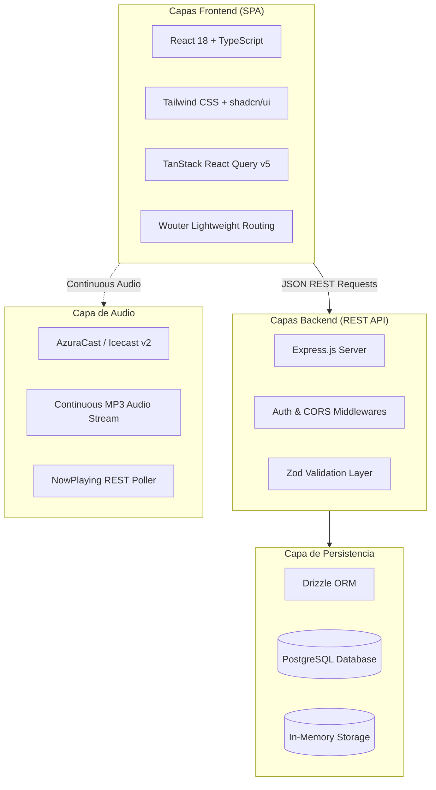

# 🏛️ Arquitectura del Sistema HabboSpeed

> Documento de diseño técnico y arquitectura de software de **HabboSpeed 2026**.

---

## 📐 1. Capas del Sistema

HabboSpeed está construido siguiendo una arquitectura en capas moderna y desacoplada que garantiza alto rendimiento, facilidad de mantenimiento y despliegues rápidos.

---

## 💻 2. Frontend (Single Page Application)

* **React 18**: Componentes funcionales modernos con hooks y renderizado optimizado.
* **Wouter**: Enrutador ultraligero que reemplaza a `react-router-dom`, reduciendo drásticamente el tamaño del bundle.
* **Carga Inmediata de Inicio**: La ruta raíz `/` se importa directamente sin esperas de `Suspense`, garantizando un primer pintado instantáneo y sin parpadeos negros.
* **TanStack Query v5**: Gestión inteligente del estado del servidor, caché automática, deduplicación de peticiones y sincronización en segundo plano.
* **Tailwind CSS & Temas Dinámicos**: Variables CSS reactivas inyectadas por el `ThemeProvider`, permitiendo cambiar estilos visuales en tiempo real sin recargar la página.

---

## ⚙️ 3. Backend & API REST

* **Express.js en TypeScript**: Servidor veloz ejecutado en desarrollo con `tsx` y compilado en producción a un único archivo optimizado mediante `esbuild` (`dist/index.cjs`).
* **Seguridad & Autenticación**:
  * Autenticación basada en **JWT (JSON Web Tokens)** con firma criptográfica.
  * Hashing de contraseñas con **bcrypt**.
  * Esquemas de validación estricta con **Zod** compartidos entre frontend y backend (`@shared/schema`).
* **Soporte Híbrido Node.js / Laravel**:
  * Implementación principal en Node.js con fallback opcional para entornos Laravel PHP mediante controladores dedicados.

---

## 💾 4. Estrategia de Almacenamiento (Dual Storage)

El backend implementa el patrón **Repository / Interface `IStorage`**, lo que permite funcionar en dos modos sin alterar el código de los controladores:

1. **Modo PostgreSQL (Producción / Docker):**
   * Gestionado con Drizzle ORM y migraciones SQL automáticas.
   * Totalmente compatible con bases de datos gestionadas (Supabase, Neon, AWS RDS).
2. **Modo MemoryStorage (Desarrollo / Storage Local):**
   * Persistencia rápida en memoria con datos sembrados realistas de Habbo Hotel (usuarios staff, rares del catálogo, horarios de DJs, noticias y temas de foro).

---

## 🎵 5. Reproductor de Radio y Tolerancia a Fallos

El componente `HabboRadioWidget` implementa una estrategia de resolución en cascada:

1. **Prioridad 1:** URL activa reportada en tiempo real por AzuraCast (`listen_url`).
2. **Prioridad 2:** URL configurada por el staff en la base de datos (`siteConfig.listenUrl`).
3. **Prioridad 3:** Fallback al proxy interno `/api/radio-stream`.
4. **Protección CORS:** Eliminación de encabezados anónimos estrictos que causan bloqueos de audio en navegadores modernos al conectar a servidores de streaming externos.
