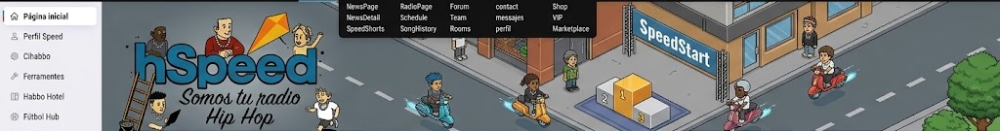
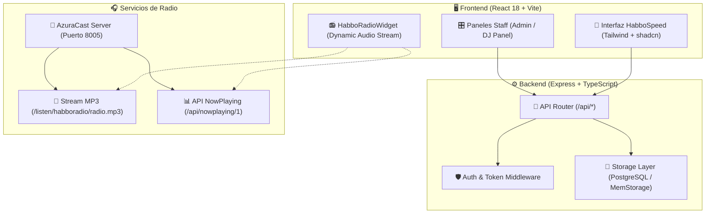

# 🏨 HabboSpeed Documentation Hub

<div align="center">



### 🌟 Plataforma Integral Fansite & Radio 24/7 para Habbo Hotel
*Documentación técnica, guías de despliegue, arquitectura y manuales de migración.*

[](https://github.com/luisitoys12/hspeed-react/releases/tag/v3.5.0)
[](https://nodejs.org)
[](https://vitejs.dev)
[](https://azuracast.com)
[](../LICENSE)

</div>

---

## 📚 Índice de Documentación

| Guía / Manual | Descripción | Audiencia |
| :--- | :--- | :--- |
| ⚡ **[Guía de Inicio Rápido](../GUIA_INSTALACION_Y_MIGRACION.md)** | Instalación en 1 clic para PC (`start-all.bat` / `start-all.sh`), cuentas por defecto y verificación de radio. | Desarrolladores / Usuarios |
| 📻 **[Sistema de Radio & Streaming](./radio-streaming.md)** | Configuración de AzuraCast, Icecast, software DJ (BUTT, Mixxx), APIs `nowplaying` y modal privado. | Locutores / DJs / Administradores |
| 🚀 **[Migración y Despliegue en VPS](./migration-vps.md)** | Despliegue en servidores Ubuntu/Debian con Nginx, SSL Let's Encrypt y PM2. | SysAdmins / DevOps |
| 🐳 **[Guía Docker & Docker Compose](./docker.md)** | Despliegue contenerizado multi-stage con Postgres y migraciones automáticas. | Desarrolladores / DevOps |
| 🏛️ **[Arquitectura del Sistema](./architecture.md)** | Visión técnica de Frontend (Vite/React), Backend (Express/TypeScript), ORM y base de datos. | Arquitectos / Desarrolladores |
| 🌐 **[Despliegue en cPanel](./CPANEL_DEPLOY.md)** | Configuración en servidores compartidos o cPanel con Node.js selector. | Webmasters |
| 🧪 **[Herramientas & Tests Automatizados](./TOOLING.md)** | Ejecución de suites E2E Playwright (`npm run verify:ui`), linters y optimización de bundles. | QA / Desarrolladores |

---

## 🗺️ Mapa de Arquitectura Visual



---

## ⚡ Comandos Rápidos del Proyecto

```bash
# 1. Iniciar todo el stack (Radio en 8005 + Web en 5000)
npm run start:all

# 2. Iniciar solo el servidor web en modo desarrollo
npm run dev

# 3. Iniciar solo el servidor de radio AzuraCast
npm run radio

# 4. Correr la suite de verificación automatizada Playwright
npm run verify:ui

# 5. Compilar el proyecto para producción
npm run build
```

---

<div align="center">
  <sub>HabboSpeed Fansite & Radio 2026 · Desarrollado para la comunidad de Habbo Hotel.</sub>
</div>
