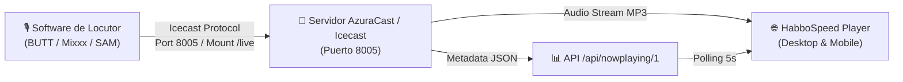

# 📻 Manual Técnico: Sistema de Radio & Streaming

> Documentación de arquitectura, configuración y locución en vivo para **HabboSpeed Radio 24/7**.

---

## 🎧 1. Visión General del Sistema

El ecosistema de radio de HabboSpeed está diseñado para ser **robusto, desacoplado y tolerante a fallos**, soportando tanto un entorno de desarrollo local como infraestructuras de streaming de alto volumen en producción (AzuraCast, Icecast o ZenoFM).



---

## ⚡ 2. Servidor de Radio Local (`script/azuracast-server.cjs`)

Para facilitar el desarrollo y pruebas locales sin depender de un servidor externo en la nube, el proyecto incluye un servidor nativo de AzuraCast/Icecast programado en Node.js:

* **Puerto:** `8005`
* **Punto de Montaje de Audio:** `http://localhost:8005/listen/habboradio/radio.mp3`
* **API de Metadatos:** `http://localhost:8005/api/nowplaying/1`
* **Loop Continuo:** Reproduce pistas de audio MP3 de muestra con rotación de metadatos realista (artista, título, carátula y número de oyentes).

### Ejecución independiente:
```bash
npm run radio
# o directamente:
node script/azuracast-server.cjs
```

---

## 🎙️ 3. Conexión de Locutores en Vivo (Software DJ)

Los locutores y DJs autorizados pueden emitir directamente desde su computadora utilizando cualquier software compatible con el protocolo **Icecast v2**:

### Parámetros de Emisión

| Parámetro | Valor para Pruebas Locales | Valor en Servidor Producción |
| :--- | :--- | :--- |
| **Tipo de Servidor** | `Icecast v2` | `Icecast v2` |
| **Dirección / Host** | `127.0.0.1` (o tu túnel público) | `radio.tudominio.com` |
| **Puerto** | `8005` | `8000` u `8005` (según config) |
| **Punto de Montaje (Mount)** | `/live` | `/live` |
| **Usuario** | `source` (o usuario DJ) | Nombre de usuario asignado |
| **Contraseña** | `hackme` | Clave individual de DJ |
| **Formato de Audio** | `MP3` / `128 kbps` / `44.1 kHz` | `MP3` / `128 kbps` / `44.1 kHz` |

> 🔒 **Seguridad y Confidencialidad:**  
> Estos datos de conexión se encuentran protegidos en la plataforma web y **únicamente se muestran a usuarios con rango `dj` o `admin`** en la sección `/djpanel`.

---

## 🎛️ 4. Formato de la API `nowplaying`

La API sigue el estándar oficial de AzuraCast para facilitar la compatibilidad:

```json
{
  "station": {
    "id": 1,
    "name": "HabboSpeed Radio",
    "shortcode": "habboradio",
    "listen_url": "http://127.0.0.1:8005/listen/habboradio/radio.mp3"
  },
  "listeners": {
    "current": 42,
    "unique": 38,
    "total": 55
  },
  "live": {
    "is_live": true,
    "streamer_name": "habbospeed"
  },
  "now_playing": {
    "elapsed": 120,
    "duration": 240,
    "song": {
      "title": "ALOH ALOH",
      "artist": "Kapo",
      "album": "Habbo Hits 2026",
      "art": "https://images.habbo.com/c_images/album1584/ACH_Music10.gif"
    }
  }
}
```

---

## 🌐 5. Configuración del Stream en Producción

Para conectar un servidor AzuraCast o Icecast remoto:

1. Inicia sesión como administrador en `http://localhost:5000/login` (`admin@habbospeed.com` / `admin123`).
2. Ve al **Panel de Administración** (`/panel`) o usa la API de configuración:
   ```http
   PUT /api/config
   Content-Type: application/json

   {
     "radioService": "azuracast",
     "apiUrl": "https://mi-radio.com/api/nowplaying/1",
     "listenUrl": "https://mi-radio.com/listen/habboradio/radio.mp3"
   }
   ```
3. El reproductor de portada y el reproductor flotante actualizarán automáticamente la fuente de audio sin requerir recargar la página.
